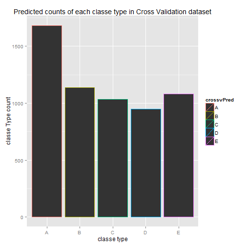
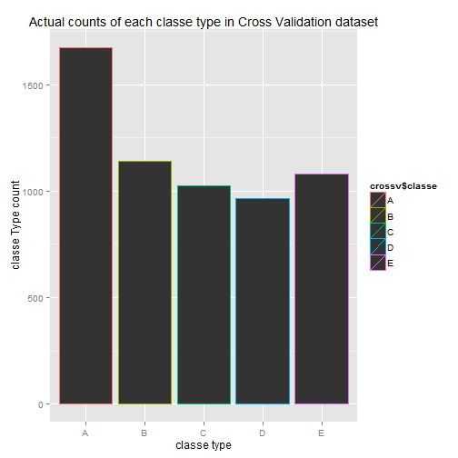

# Practical Machine Learning: Course Project Writeup


## Synopsis
As indicated in the Practical Machine Learning Peer Assessment, the goal of the project is to predict the manner in which people did exercise, as indicated by the "classe" variable.  Data were collected on 6 participants doing barbell lifts correctly and incorrectly in five different ways, using devices such as Jawbone Up, Nike FuelBand, and Fitbit.

The training data for this project are available here: 

https://d396qusza40orc.cloudfront.net/predmachlearn/pml-training.csv

The test data are available here: 

https://d396qusza40orc.cloudfront.net/predmachlearn/pml-testing.csv

The training dataset was split into training (70%) and Cross Validation (30%).  A model is fit on this new training dataset and then it was used to predict the "classe" on the Cross Validation set and determine the accuracy.

## Data Processing
This first loads the appropriate libraries.

```r
library(caret)
```

```
## Loading required package: lattice
## Loading required package: ggplot2
```

```r
library(lattice)
library(ggplot2)
library(stats)
library(randomForest)
```

```
## randomForest 4.6-7
## Type rfNews() to see new features/changes/bug fixes.
```

Ensure the pml-training.csv dataset and pml-testing.csv dataset have been downloaded to the local directory.
Read in the activity datasets.

```r
pmltraining<-read.csv("pml-training.csv")
pmltesting<-read.csv("pml-testing.csv")
```


Partition the data set into training and cross validation.  Put 70% of the pml-training dataset into the training dataset and 30% into the cross validation dataset.

```r
inTrain <- createDataPartition(y=pmltraining$classe,                               p=0.7, list=FALSE)
training<-pmltraining[inTrain,]
crossv<-pmltraining[-inTrain,]
```

Set the computation control of the train function to make it run much faster, instead of using the default bootstrapping method in train.

```r
trctrl = trainControl(method = "cv", number = 4,allowParallel=TRUE)
```

The training set has 159 variables.  Train the training dataset, by using the random forest method on "classe" and only those 52 predictors that gather sensor data.  Use the train control created in the previous step to fit the model.

```r
modFit <- train(classe ~ roll_belt + pitch_belt + yaw_belt +               total_accel_belt + gyros_belt_x + gyros_belt_y + gyros_belt_z +               accel_belt_x + accel_belt_y + accel_belt_z + magnet_belt_x +               magnet_belt_y + magnet_belt_z + roll_arm + pitch_arm + yaw_arm +                 total_accel_arm + gyros_arm_x + gyros_arm_y + gyros_arm_z +                 accel_arm_x + accel_arm_y + accel_arm_z + magnet_arm_x +               magnet_arm_y + magnet_arm_z + roll_dumbbell + pitch_dumbbell +                 yaw_dumbbell + total_accel_dumbbell + gyros_dumbbell_x +                 gyros_dumbbell_y + gyros_dumbbell_z +accel_dumbbell_x +                 accel_dumbbell_y + accel_dumbbell_z + magnet_dumbbell_x +                 magnet_dumbbell_y + magnet_dumbbell_z + roll_forearm +                 pitch_forearm + yaw_forearm + total_accel_forearm + gyros_forearm_x +                 gyros_forearm_y + gyros_forearm_z + accel_forearm_x +                 accel_forearm_y + accel_forearm_z + magnet_forearm_x +                 magnet_forearm_y + magnet_forearm_z,method="rf",data=training,trControl = trctrl)
```

## Results

### We see the model fit accuracy on the training dataset is approximately 99%, with an error rate of approximately 1%.  When using this model on the Cross Validation dataset, our accuracy is greater than 99% and our error rate is less than 1%.  We can compare the two plots: one for the predicted counts in each classe type in the Cross Validation dataset and one for the actual counts in each classe type in the Cross Validation dataset.  We see the plots are virtually identical.  A prediction was also done on the pml-testing dataset for use in the Course Project: Submission.

Determine the accuracy of the modelFit.

```r
print("The training result accuracy with 52 predictors")
```

```
## [1] "The training result accuracy with 52 predictors"
```

```r
print(modFit$results[2,2])
```

```
## [1] 0.9902
```

Caculate the training error rate

```r
trainingerrorrate<-1-as.numeric(modFit$results[2,2])
print("Training error rate")
```

```
## [1] "Training error rate"
```

```r
print(trainingerrorrate)
```

```
## [1] 0.009827
```

Predict the outcome for the Cross Validation dataset based on the modFit from the training dataset.

```r
crossvPred<-predict(modFit,crossv)
```

Determine the accuracy of the Cross Validation

```r
crossvaccuracy<-postResample(crossvPred, crossv$classe)
print("The Cross Validation accuracy based on the prediction:")
```

```
## [1] "The Cross Validation accuracy based on the prediction:"
```

```r
print(crossvaccuracy[1])
```

```
## Accuracy 
##    0.991
```

Caculate the out of sample error rate

```r
errorrate<-1-as.numeric(crossvaccuracy[1])
print("Error rate")
```

```
## [1] "Error rate"
```

```r
print(errorrate)
```

```
## [1] 0.009006
```

Plot the predicted activity for the Cross Validation dataset for the count of the different types (A, B, C, D, E) within the classe variable

```r
print(qplot(crossvPred, color=crossvPred,main="Predicted counts of each classe type in Cross Validation dataset",xlab="classe type",ylab="classe Type count"))
```

 

Plot the actual activity for the Cross Validation dataset for the count of the different types (A, B, C, D, E) within the classe variable

```r
print(qplot(crossv$classe, color=crossv$classe,main="Actual counts of each classe type in Cross Validation dataset",xlab="classe type",ylab="classe Type count"))
```

 

Do the prediction on the pmltesting dataset.  This predicts the outcome (A, B, C, D, or E) for the 20 observations in the pmltesting dataset which are used in the Course Project Submission.

```r
testPred<-predict(modFit,pmltesting)
print("The predicted outcome for the testing dataset.  This is used in the Course Project Submission")
```

```
## [1] "The predicted outcome for the testing dataset.  This is used in the Course Project Submission"
```

```r
print(testPred)
```

```
##  [1] B A B A A E D B A A B C B A E E A B B B
## Levels: A B C D E
```
